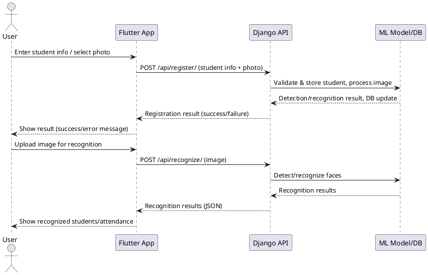

# Verification & Validation Documentation

## 1. Verification & Validation Overview

This document outlines the verification and validation (V&V) approach for the Open RTMS Flutter application, which includes student registration with photo capture or selection, face detection, and attendance features. The V&V process ensures the app meets its requirements, functions correctly under expected and edge conditions, and handles failures gracefully.

---

## 2. Test Case Specifications

| Test Case ID | Description | Preconditions | Steps | Expected Result |
|--------------|-------------|---------------|-------|-----------------|
| TC-01 | Register student with camera photo | App running, camera available | 1. Open registration screen<br>2. Enter valid name and ID<br>3. Take photo<br>4. Register | Student is registered, success message shown |
| TC-02 | Register student with gallery photo | App running, gallery access | 1. Open registration screen<br>2. Enter valid name and ID<br>3. Select photo from gallery<br>4. Register | Student is registered, success message shown |
| TC-03 | Register student with missing fields | App running | 1. Open registration screen<br>2. Leave name or ID blank<br>3. Try to register | Error message: "Please fill out all fields" |
| TC-04 | Register student without photo | App running | 1. Open registration screen<br>2. Enter name and ID<br>3. Do not take/select photo<br>4. Try to register | Error message: "Please take a picture first" |
| TC-05 | Upload image with no faces | App running | 1. Go to image upload<br>2. Select image with no faces<br>3. Process image | Error message: "No faces detected in the image" |
| TC-06 | Upload image with multiple faces | App running | 1. Go to image upload<br>2. Select image with several faces<br>3. Process image | All faces detected and recognized if known |

---

## 3. Boundary Value Test Cases

| Test Case ID | Input | Expected Result |
|--------------|-------|----------------|
| BV-01 | Name field: 1 character | Registration allowed if valid |
| BV-02 | Name field: 100 characters | Registration allowed if valid |
| BV-03 | Student ID: minimum allowed (e.g., 1) | Registration allowed |
| BV-04 | Student ID: maximum allowed (e.g., 999999) | Registration allowed |
| BV-05 | Image file: minimum size (just above 0 bytes) | Error: "Image file too small or corrupted" |
| BV-06 | Image file: maximum supported size (e.g., 10MB) | Registration or upload succeeds if device memory allows |

---

## 4. Formal Verification Methods

- **Code Review:** All critical logic (registration, image handling, face detection) is reviewed for correctness and security.
- **Static Analysis:** Dart analyzer and linter are used to catch type errors, null safety issues, and code smells.
- **Unit Testing:** Key provider methods (e.g., `registerStudent`, `setCurrentImage`, face detection) are covered by unit tests.
- **Widget Testing:** UI flows (registration, image upload) are tested using Flutter's widget test framework.
- **Integration Testing:** End-to-end scenarios are automated to verify the app's behavior in real device/simulator environments.

---

## 5. Failure Mode Analysis

- **Camera unavailable:** User is notified, and registration cannot proceed with camera photo.
- **Gallery access denied:** User is notified, and registration cannot proceed with gallery photo.
- **Image decode failure:** User is notified, and registration/upload is blocked.
- **Face detection model not loaded:** User is notified, and face detection/upload is blocked.
- **Backend unavailable:** User is notified, and registration/upload is retried or blocked.
- **Invalid input (empty fields, invalid ID):** User is notified, and registration is blocked.

---

## 6. FMEA Table Excerpt

| Failure Mode | Effect | Cause | Detection | Severity | Occurrence | Detection | Mitigation |
|--------------|--------|-------|-----------|----------|------------|-----------|------------|
| Camera not available | Cannot take photo | Hardware issue, permission denied | Error message shown | High | Medium | High | Prompt user, allow gallery selection |
| Gallery access denied | Cannot select photo | Permission denied | Error message shown | High | Medium | High | Prompt user to grant permission |
| Image decode fails | Registration/upload fails | Corrupt or unsupported image | Error message shown | Medium | Low | High | Validate image before upload |
| No face detected | Registration/upload fails | Poor image, no face in image | Error message shown | Low | Medium | High | Prompt user to retake/select another photo |
| Backend not reachable | Registration/upload fails | Network/server issue | Error message shown | High | Medium | Medium | Retry, offline queue, notify user |
| Invalid input | Registration fails | User error | Error message shown | Low | High | High | Input validation, clear error messages |

---

# Implementation

## 1. System Architecture Overview

| Component   | Description                                                                                 |
|------------|---------------------------------------------------------------------------------------------|
| Frontend   | Flutter mobile app for student registration, image upload, and attendance management        |
| Backend    | Django REST API for student data, face recognition, and attendance logic                   |
| ML/AI      | YOLOv8 for face detection, custom face recognition models (TensorFlow/ONNX/TFLite)         |
| Database   | PostgreSQL, SQLite, or other supported DBMS                                                |

**Suggested Diagram:**
```
[Flutter App] <----REST API----> [Django Backend] <----> [ML Models, Database]
```

## 2. Technology Stack

| Layer         | Technology/Library                |
|---------------|-----------------------------------|
| Frontend      | Flutter (Dart)                    |
| Backend       | Django (Python)                   |
| ML/AI         | YOLOv8, TensorFlow/ONNX/TFLite    |
| Database      | PostgreSQL, SQLite                |
| API           | REST (JSON over HTTP)             |
| Image Proc.   | Pillow, OpenCV (backend)          |

## 3. Key Components and Implementation

### Flutter App
| Feature                | Implementation Details                                                                                 | Example Code/Snippet |
|------------------------|-------------------------------------------------------------------------------------------------------|----------------------|
| Student Registration   | UI for entering name, ID, and capturing/selecting a photo. Uses `camera` and `image_picker` packages. | `ElevatedButton.icon(onPressed: _pickImageFromGallery, icon: Icon(Icons.photo_library), label: Text('Select Photo'))` |
| Image Upload & Detection| Calls backend API with image file. Handles detection results and overlays.                            | ...existing code...  |
| Attendance Tracking    | Displays recognized students and attendance summary.                                                   | ...existing code...  |
| Error Handling         | Uses `ScaffoldMessenger` for user feedback.                                                           | `ScaffoldMessenger.of(context).showSnackBar(SnackBar(content: Text('Error: $e')))` |

### Django Backend
| Feature                | Implementation Details                                                                                 | Example Code/Snippet |
|------------------------|-------------------------------------------------------------------------------------------------------|----------------------|
| API Endpoints          | `/api/register/` (POST): Register student with photo. `/api/recognize/` (POST): Recognize faces.      | ...existing code...  |
| Image Validation       | Validates file type, size, and decodes image.                                                         | `img = Image.open(uploaded_file)` |
| Face Detection/Recog.  | Uses YOLOv8 for detection, custom model for recognition.                                              | `results = yolo_model.detect(img)` |
| Database Models        | Student, Attendance, FaceEmbedding, etc.                                                              | `class Student(models.Model): ...` |
| Error Handling         | Returns JSON error messages and HTTP status codes.                                                    | `{ "error": "Face not detected" }` |

## 4. Data Flow

| Step | Description                                                                                       |
|------|---------------------------------------------------------------------------------------------------|
| 1    | User enters student info and uploads/selects photo in Flutter app                                 |
| 2    | App sends data to Django backend via REST API                                                     |
| 3    | Backend processes image, performs face detection/recognition, updates database                    |
| 4    | Backend returns results/status to app                                                             |

**Suggested Sequence Diagram:**
```
User -> Flutter App -> Django API -> ML Model/DB -> Django API -> Flutter App -> User
```

## Sequence Diagram (PlantUML)



You can render this diagram using any PlantUML-compatible tool or online editor (e.g., [PlantUML Online Server](https://www.plantuml.com/plantuml/)).

## 5. Security and Privacy Considerations

| Aspect         | Implementation/Recommendation                                      |
|----------------|--------------------------------------------------------------------|
| Image Uploads  | Validate type and size on backend                                  |
| Data Storage   | Store sensitive data securely (photos, IDs)                        |
| API Security   | Protect endpoints with authentication (JWT, OAuth2 recommended)    |
| Communication  | Use HTTPS for all client-server communication                      |

## 6. Error Handling and Logging

| Layer     | Method/Example                                                                                 |
|-----------|-----------------------------------------------------------------------------------------------|
| Frontend  | User-friendly error messages for all failure modes. <br> `ScaffoldMessenger.of(context).showSnackBar(SnackBar(content: Text('Error: $e')))` |
| Backend   | Logs all errors and exceptions. <br> Returns clear JSON error responses: `{ "error": "Face not detected" }` |

## 7. Extensibility and Maintenance

| Aspect         | Implementation/Recommendation                                      |
|----------------|--------------------------------------------------------------------|
| Modularity     | Modular code structure in both frontend and backend                |
| Feature Add    | Easy to add new features (e.g., new ML models, extra fields)       |
| API Contracts  | Backend and frontend can be updated independently if API is stable |

---

**Suggestions:**
- Add architecture and sequence diagrams using tools like draw.io or Mermaid for clarity.
- Include code snippets for any custom logic or complex flows.
- Document API contracts (request/response formats) in a separate section or OpenAPI/Swagger file.

**Note:** This documentation should be updated as the app evolves and more test cases or failure modes are identified.